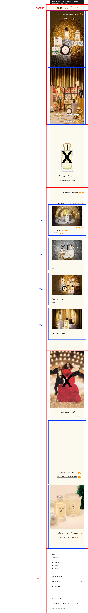
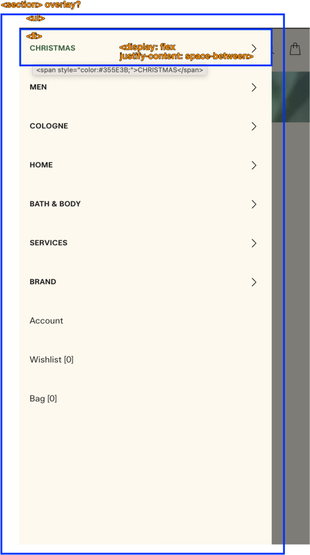
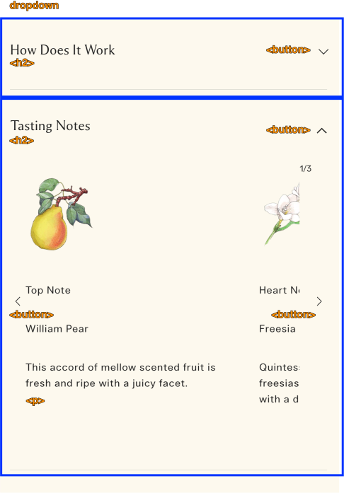
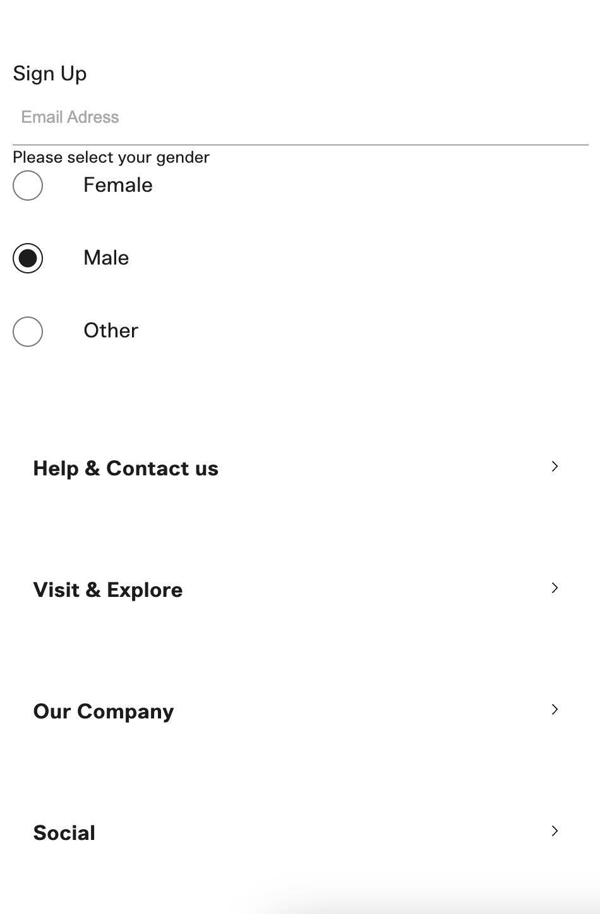
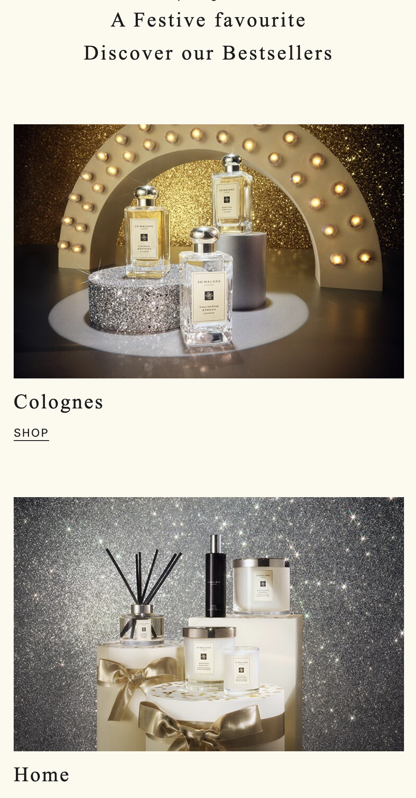
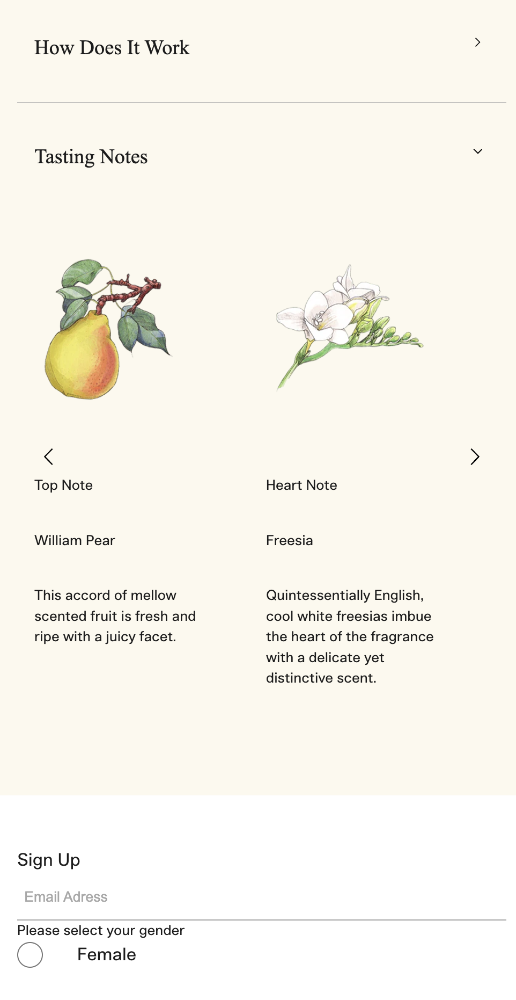
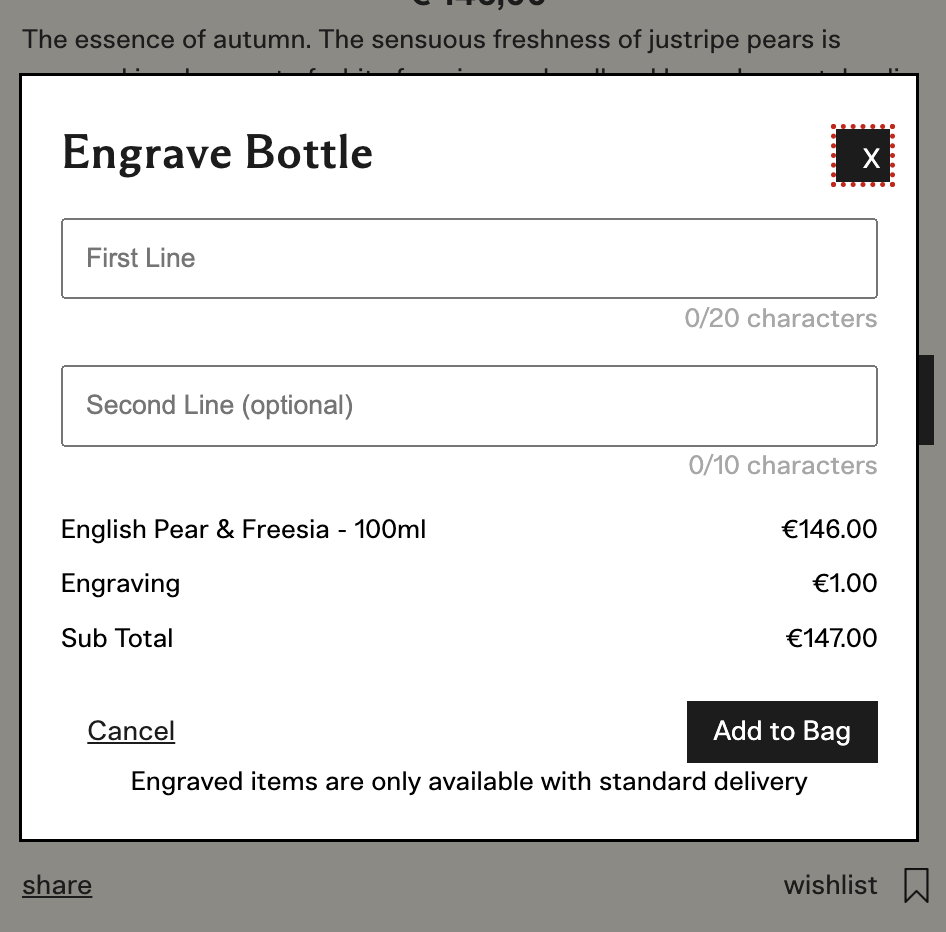
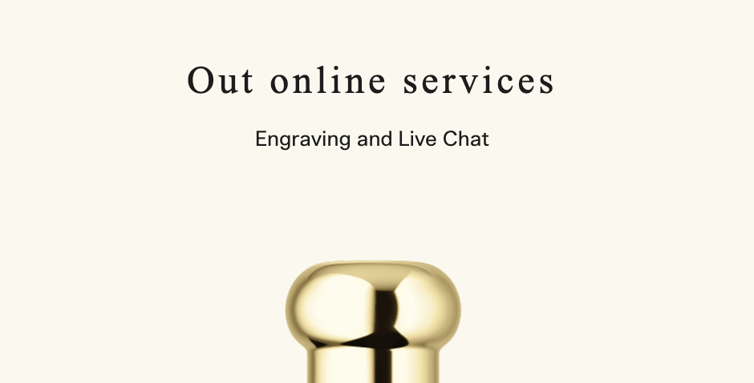
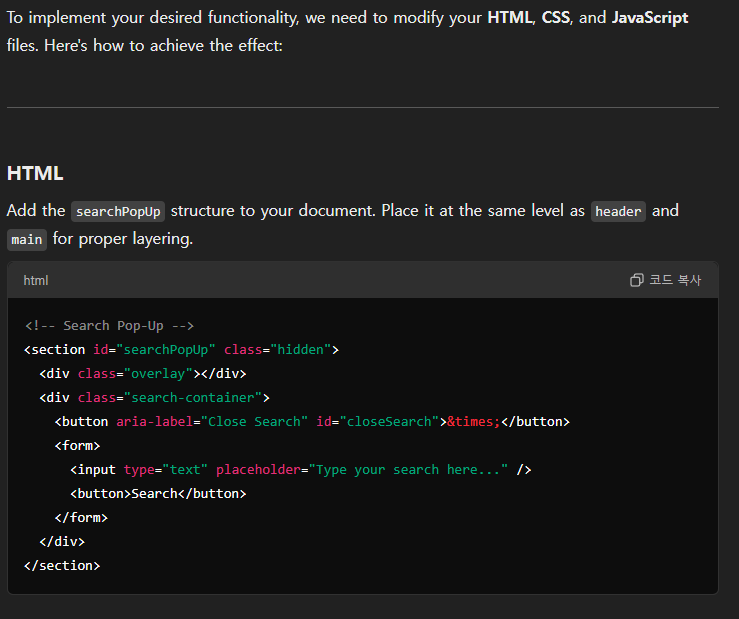

# Procesverslag

Markdown is een simpele manier om HTML te schrijven.  
Markdown cheat cheet: [Hulp bij het schrijven van Markdown](https://github.com/adam-p/markdown-here/wiki/Markdown-Cheatsheet).

Nb. De standaardstructuur en de spartaanse opmaak van de README.md zijn helemaal prima. Het gaat om de inhoud van je procesverslag. Besteedt de tijd voor pracht en praal aan je website.

Nb. Door _open_ toe te voegen aan een _details_ element kun je deze standaard open zetten. Fijn om dat steeds voor de relevante stuk(ken) te doen.

## Jij

  
uitwerken voor kick-off werkgroep

### Auteur:

Helina Kim

#### Je startniveau:

rood

#### Je focus:

surface plane!

## Je website

  
uitwerken voor kick-off werkgroep

### Je opdracht:

https://www.jomalone.eu/nl/en/
JoMalone/ Britse parfum merk

#### Screenshot(s) van de eerste pagina (small screen):

hier de naam van de pagina  
 

#### Screenshot(s) van de tweede pagina (small screen):

hier de naam van de pagina  
 

## Toegankelijkheidstest 1/2 (week 1)

  
uitwerken na test in 2e werkgroep

### Bevindingen

Lijst met je bevindingen die in de test naar voren kwamen:

#### Screenreader

Positief

- De tab-index is logisch georganiseerd

Negatief

- De screenreader werkte goed, maar las soms de code elementen voor wat niet nodig is voor de gebruiker.
- Bij de navigatiebar zegt de screenreader 'article' in plaats van wat de icoon betekent en waar die naartoe navigeert
- De screenreader leest per sectie 'article' en daarbij is er geen extra toelichting wat voor 'article'/ sectie het inhoudt
- Bij knoppen zegt de screenreader dat de gebruiker op een 'group' is in plaats van button
- Op het product pagina is de radio-button niet selecteerbaar
- De screenreader leest de alt-teksten van de imgaes niet voor en het is niet te selecteren

#### WCAG-checklist

- De content is goed; duiedlijke taalgebrui + passende foto's
- Globale code;
- Keyboard; de tab-indez is in logische volgorde (tab & shift+tab)
- Mobile and touch; er is sprake van horizontale scrolling, maar er is een button waar de gebruiker erop kan klikken
  - Bij index (begin pagina) is breadcrumbs die klikbaar zijn, maar die te klein is erop te klikken. De gebruiker kan **wel** erop scrollen (horizontale scroll)
- Headings; er is **geen** H1!!! Daarom skipt hij de heading levels, omdat de pagina met p en daarna meteeen h2 komt.
- De website gebruikt geen ol, ul voor list-items voor de navigatiebar, etc.
- Images;

## Breakdownschets (week 1)

  
uitwerken na afloop 3e werkgroep

### de hele pagina:

  

### dynamisch deel (bijv menu):

- er is een overlay over de 80% van de pagina
- er is een button om het menu te openen
- er is geen button om het menu te sluiten

### wellicht nog een dynamisch deel (bijv filter):

- dropdown menu met buttons
- er is een card carousel met 3 items
  

## Voortgang 1 (week 2)

  
uitwerken voor 1e voortgang

### Stand van zaken

hier dit ging goed & dit was lastig (neem ook screenshots op van delen van je website en code)
Het gaat goed:
- ik heb algemene content van website in html geschreven
- ik heb custom property gebruikt voor kleuren
- alle benodigde foto's zijn toegevoegd

Dit is lastig:
- ik heb nog geen idee hoe ik de dropdown menu moet maken
- ik heb nog geen idee hoe ik de card carousel moet maken
- html elementen veranderen constant vergeleken met mijn breakdownschets

### Agenda voor meeting

samen met je groepje opstellen

| Helina | Ivy                | Milo    |
| --------- | ------------------ | ------------ |
| Algemene vragen over CSS     | Algemeen over CSS      | Algemeen over CSS    |
| Mag je echt geen class of id gebruiken?  | nog een punt | |

### Verslag van meeting

hier na afloop snel de uitkomsten van de meeting vastleggen

- Geen ID en Class gebruiken!
- :nth-of-child() actiever gebruiken
- custom property gebruiken voor kleuren
- details en summary gebruiken voor de dropdown menu

## Voortgang 2 (week 3)

  
uitwerken voor 2e voortgang

### Stand van zaken

#Wat ging er goed
- De pagina layout is goed gemaakt met gebruik van flexbox.
- Het maken van footer is goed gegaan. Ik kond de accentkleur toepassen wat ik had geleerd tijdens de werkcollege.

#Wat was er nog lastig
- Het is nog lastig om dark en light mode te maken met custom property. Soms werkt het wel en soms niet.
- Het kost veel tijd om een pagina af te maken, dus ik ben bang dat ik later niet genoeg tijd heb voor de tweede pagina.
- Ik vind het lastig voor wanneer grid nodig is en voor wanneer flexbox.
- De card carousel is nog lastig om te maken.

### Agenda voor meeting

samen met je groepje opstellen

| Helina         | Ivy                |
| -------------- | ------------------ |
| Ik wil over light en darkmode hebben.  | Er is een error bij de github           |
| Soms verandert hij goed, en soms werkt de kleuren niet. | |

### Verslag van meeting

hier na afloop snel de uitkomsten van de meeting vastleggen

- Goed op de spaties letten bij de :root
- Github op de hoogte houden
- Later testen met github en screenreader

## Toegankelijkheidstest 2/2 (week 4)

  
uitwerken na test in 9e werkgroep

### Bevindingen

Lijst met je bevindingen die in de test naar voren kwamen (geef ook aan wat er verbeterd is):

- Er zijn geen aria labels voor de sommige buttons
- De screenreader geeft geen waarschuwing bij het navigeren naar de footer

* De tabindex werkt goed
* De buttons met aira-labels leest de screenreader goed

* Je kan met control + option + u bij screenreader de pagina mode selecteren bijvoorbeeld alle headings/ links/ buttons/ etc.

## Voortgang 3 (week 4)

  
uitwerken voor 3e voortgang

### Stand van zaken

hier dit ging goed & dit was lastig (neem ook screenshots op van delen van je website en code)

### Agenda voor meeting

samen met je groepje opstellen

- Wat we moeten doen voor een voldoende
- Hoe worden de codes beoordeeld?

| Helina    | Milo         | 
| -------------- | ------------------ | 
| Hoe kan ik met checkbox custom theme maken?  | Responsive header maken         | 

### Verslag van meeting

hier na afloop snel de uitkomsten van de meeting vastleggen

- gebruik :root voor de kleuren veranderen van de custom property 
- value van de checkbox goed gebruiken voor het selecteren van custom theme

## Eindgesprek (week 5)

  
uitwerken voor eindgesprek

### Je uitkomst - karakteristiek screenshots:
  
  
  
### Dit ging goed/Heb ik geleerd:

  
  Ik ben super blij met dialoog van mijn pagina. In de dialog zit een character counter voor de input field. Dankzij bron is het gelukt. Na dat ik de brond zag, snapte ik hoe ik de code moest aanpakken.

  Verder heb ik tijdens de frot-end development geleerd hoe specifiek css selectors kon gebruiken. Hiervoor wist ik niet dat ik de :nth-of-type() kon gebruiken. 

### Dit was lastig/Is niet gelukt:

  
  Ik heb de text carousel gemaakt, maar het is me niet gelukt nog om indicators te maken. De animaties werken goed, maar als ik de sync met de indicators wil maken, dan werkt het niet. Voor de volgende keer zal ik nogmaals goed naar de bron zoeken van indicators.

  Ik vond het ook nog lastig om de css code zonder classes en ids te schrijven. Ik heb de code geschreven met classes en ids, maar ik heb geleerd dat ik de code zonder classes en ids kan schrijven. Ik wil voor de volgende keer beter leren voor wanneer class en id wel of niet nodig zijn.

## Bronnenlijst

  
continu bijhouden terwijl je werkt

Nb. Wees specifiek ('css-tricks' als bron is bijv. niet specifiek genoeg).
Nb. ChatGpT en andere AI horen er ook bij.
Nb. Vermeld de bronnen ook in je code.

1. Iconen:
- gift icon: https://www.flaticon.com/free-icon/gift_658015?term=present&page=1&  position=13&origin=tag&related_id=658015
- perfume icon: https://www.flaticon.com/free-icon/cologne_3118526?term=perfume&page=1&position=86&origin=search&related_id=3118526
- car icon:  https://www.flaticon.com/free-icon/delivery-car_7615749?term=delivery&page=1&position=39&origin=search&related_id=7615749
-  mic icon: https://www.flaticon.com/free-icon/microphone_107737?term=mic&page=1&position=9&origin=search&related_id=107737
- pause icon: https://www.flaticon.com/free-icon/pause_2404385?term=pause&page=1&position=21&origin=search&related_id=2404385
- play icon: https://www.flaticon.com/free-icon/play_3024584?term=play&page=1&position=8&origin=search&related_id=3024584

2. script.js
   voor header: https://stackoverflow.com/questions/63902512/js-show-hide-header-on-scroll-effect-but-only-after-the-header-has-scrolled

3. product.js:
    voor character counter: ChatGpt prompt:
    "how to create a character counter for a text input in javascript"

4. christmas music: https://www.youtube.com/watch?v=2j9LjgdF-gQ

5. Search bar: ChatGpt prompt: "I want to add a new feature. now the input field next to the search icon is visible. i want to make it hidden, and when the search icon is clicked, i want to show something over the screen. The html that will be shown over the screen will have the same background colour as the main background colour, and it will have an input field in there. i will call this html searchPopUp. behind search pop up, the page will be greyed out (darkened). the search pop up also has a cross button on the top right corner, which when clicked dismisses the search pop up. can you make this functionality? if i need to add something to my css, please tell me that as well."

  "Lets avoid using ids. Can we do this without classes and ids in html?"
  
  
  

  "great! this works. let me tell you how the search pop up should look like in a bit more detail.
It fills up the whole screen with no round corners, except that it leaves about 10% of the screen size on the bottom.
the cross button has a bit of padding around.
the input field is right underneath the cross button. At the rightmost end of the input field is a button. lets use any image for this for now.
underneath the seach bar, after some space, there is a text "NEED A LITTLE INSPIRATION?" center-aligned. underneath that text, there is a button where users can navigate: it has a button in the middle, and arrows on the left and right of the button, which when clicked, shows the next or previous button in the middle with sliding animations. the texts in these buttons could be A,B,C,D, and E for now. please make the necessary changes."
+ "the option button is not in the middle. the a, b, c, d, and e buttons should be in the middle with the arrow buttons being on the sides. 
also, i want the input field to be a bit taller and wider.
i also need more space between the input field and the "need a little inspiration?" part should have some space in the middle.

lastly, lets make our search pop up 100% of the screen."
+ "how can i align this button to the middle?
/* Option Button */
section[aria-hidden] > div:nth-of-type(2) > div[role="navigation"] > button:nth-of-type(2) {
  border: none; 
  padding: 0.8em 1.5em;
  font-size: 1rem;
  background: var(--button-bg);
  color: var(--color-background);
  cursor: pointer;
}"
+ "how can change the font colour of the text inside a button or the placeholder for text input?"
+ "these are the texts for buttons. can you replace the A B C D E with these?
["COMPLIMENTARY FESTIVE DUO", "12 DAY ADVENT CALENDAR", 
    "GINGER BISCUIT", "ORANGE BITTERS","FIR & ARTEMISIA", "HINOKI & CEDARWOOD", 
    "CHRISTMAS GIFTS", "HOME & CANDLES", "COLOGNES", "GIFTS FOR HER", "GIFTS FOR HIM"];"

