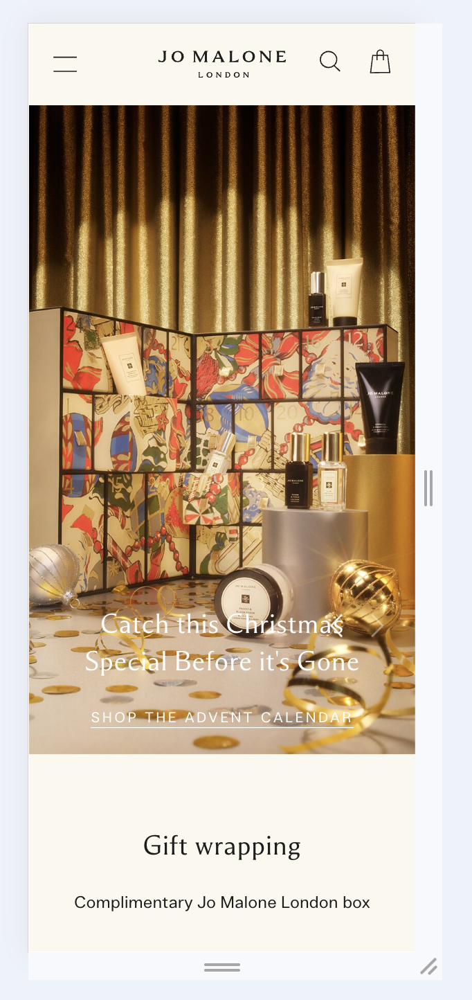
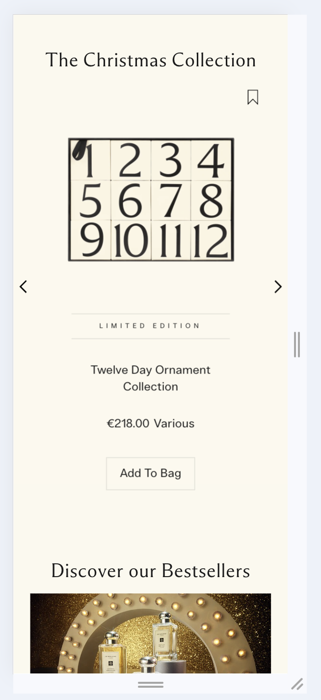
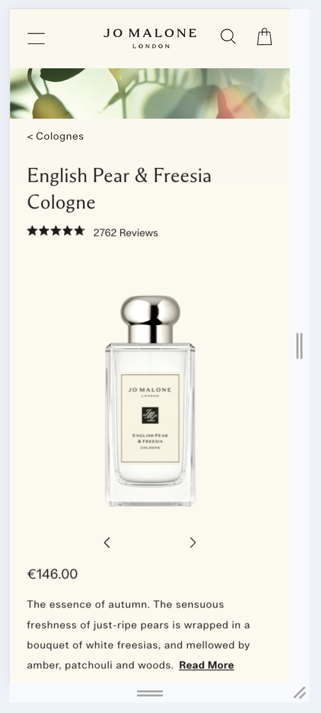
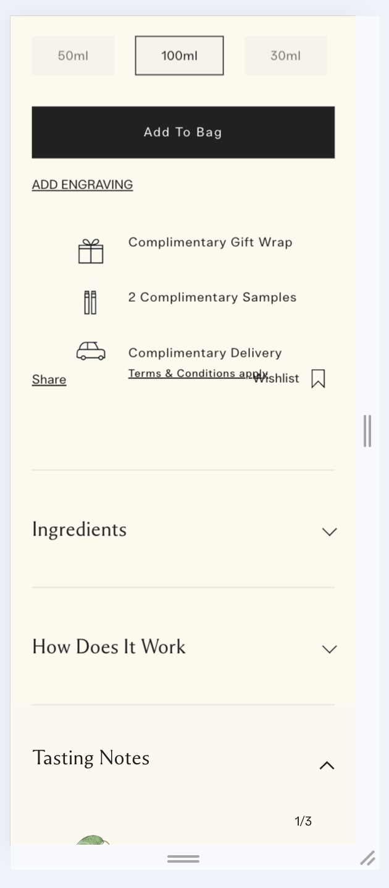
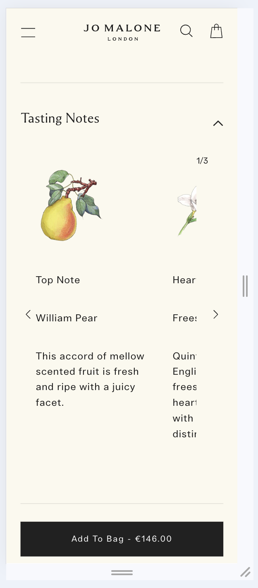
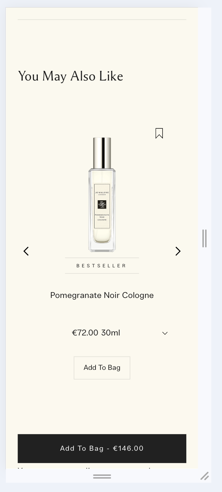
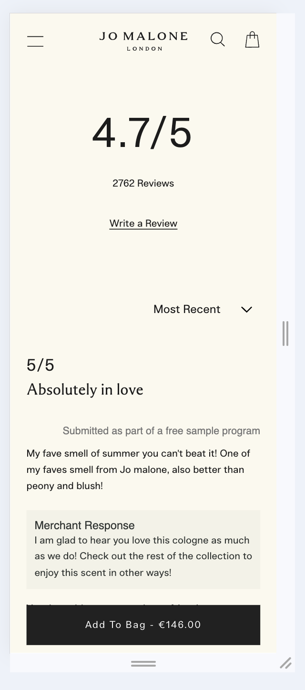
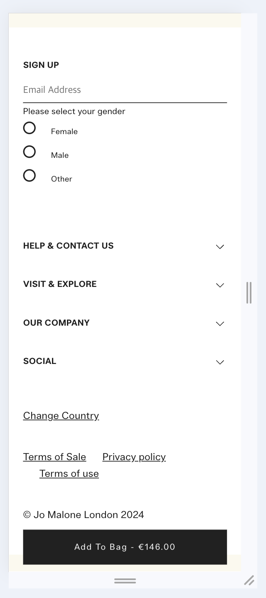

# Procesverslag

Markdown is een simpele manier om HTML te schrijven.  
Markdown cheat cheet: [Hulp bij het schrijven van Markdown](https://github.com/adam-p/markdown-here/wiki/Markdown-Cheatsheet).

Nb. De standaardstructuur en de spartaanse opmaak van de README.md zijn helemaal prima. Het gaat om de inhoud van je procesverslag. Besteedt de tijd voor pracht en praal aan je website.

Nb. Door _open_ toe te voegen aan een _details_ element kun je deze standaard open zetten. Fijn om dat steeds voor de relevante stuk(ken) te doen.

## Jij

  
uitwerken voor kick-off werkgroep

### Auteur:

Helina Kim

#### Je startniveau:

rood

#### Je focus:

surface plane!

## Je website

  
uitwerken voor kick-off werkgroep

### Je opdracht:

https://www.jomalone.eu/nl/en/
JoMalone/ Britse parfum merk

#### Screenshot(s) van de eerste pagina (small screen):

hier de naam van de pagina  
 

#### Screenshot(s) van de tweede pagina (small screen):

hier de naam van de pagina  
 

## Toegankelijkheidstest 1/2 (week 1)

  
uitwerken na test in 2e werkgroep

### Bevindingen

Lijst met je bevindingen die in de test naar voren kwamen:

#### Screenreader

Positief

- De tab-index is logisch georganiseerd

Negatief

- De screenreader werkte goed, maar las soms de code elementen voor wat niet nodig is voor de gebruiker.
- Bij de navigatiebar zegt de screenreader 'article' in plaats van wat de icoon betekent en waar die naartoe navigeert
- De screenreader leest per sectie 'article' en daarbij is er geen extra toelichting wat voor 'article'/ sectie het inhoudt
- Bij knoppen zegt de screenreader dat de gebruiker op een 'group' is in plaats van button
- Op het product pagina is de radio-button niet selecteerbaar
- De screenreader leest de alt-teksten van de imgaes niet voor en het is niet te selecteren

#### WCAG-checklist

- De content is goed; duiedlijke taalgebrui + passende foto's
- Globale code;
- Keyboard; de tab-indez is in logische volgorde (tab & shift+tab)
- Mobile and touch; er is sprake van horizontale scrolling, maar er is een button waar de gebruiker erop kan klikken
  - Bij index (begin pagina) is breadcrumbs die klikbaar zijn, maar die te klein is erop te klikken. De gebruiker kan **wel** erop scrollen (horizontale scroll)
- Headings; er is **geen** H1!!! Daarom skipt hij de heading levels, omdat de pagina met p en daarna meteeen h2 komt.
- De website gebruikt geen ol, ul voor list-items voor de navigatiebar, etc.
- Images;

## Breakdownschets (week 1)

  
uitwerken na afloop 3e werkgroep

### de hele pagina:

  

### dynamisch deel (bijv menu):

  

### wellicht nog een dynamisch deel (bijv filter):

  

## Voortgang 1 (week 2)

  
uitwerken voor 1e voortgang

### Stand van zaken

hier dit ging goed & dit was lastig (neem ook screenshots op van delen van je website en code)

### Agenda voor meeting

samen met je groepje opstellen

| student 1 | student 2          | student 3    | student 4        |
| --------- | ------------------ | ------------ | ---------------- |
| CSS       | De kleuren         | en ik dit    | en dan ik dat    |
|           | dit als er tijd is | nog een punt | dit wil ik zeker |
| ...       | ...                | ...          | ...              |

### Verslag van meeting

hier na afloop snel de uitkomsten van de meeting vastleggen

- Geen ID en Class
- punt 2
- nog een punt

## Voortgang 2 (week 3)

  
uitwerken voor 2e voortgang

### Stand van zaken

hier dit ging goed & dit was lastig (neem ook screenshots op van delen van je website en code)

### Agenda voor meeting

samen met je groepje opstellen

| Helina         | Ivy                |
| -------------- | ------------------ |
| dit bespreken  | en dit             |
| en dat ook nog | dit als er tijd is |
| ...            | ...                |

### Verslag van meeting

hier na afloop snel de uitkomsten van de meeting vastleggen

- punt 1
- punt 2
- nog een punt
- ...

## Toegankelijkheidstest 2/2 (week 4)

  
uitwerken na test in 9e werkgroep

### Bevindingen

Lijst met je bevindingen die in de test naar voren kwamen (geef ook aan wat er verbeterd is):

- Er zijn geen aria labels voor de sommige buttons
- De screenreader geeft geen waarschuwing bij het navigeren naar de footer

* De tabindex werkt goed
* De buttons met aira-labels leest de screenreader goed

## Voortgang 3 (week 4)

  
uitwerken voor 3e voortgang

### Stand van zaken

hier dit ging goed & dit was lastig (neem ook screenshots op van delen van je website en code)

### Agenda voor meeting

samen met je groepje opstellen

- Wat we moeten doen voor een voldoende
- Hoe worden de codes beoordeeld?

| student 1      | student 2          | student 3    | student 4        |
| -------------- | ------------------ | ------------ | ---------------- |
| dit bespreken  | en dit             | en ik dit    | en dan ik dat    |
| en dat ook nog | dit als er tijd is | nog een punt | dit wil ik zeker |
| ...            | ...                | ...          | ...              |

### Verslag van meeting

hier na afloop snel de uitkomsten van de meeting vastleggen

- punt 1
- punt 2
- nog een punt
- ...

## Eindgesprek (week 5)

  
uitwerken voor eindgesprek

### Je uitkomst - karakteristiek screenshots:

  

### Dit ging goed/Heb ik geleerd:

Korte omschrijving met plaatjes

  

### Dit was lastig/Is niet gelukt:

Korte omschrijving met plaatjes

  

## Bronnenlijst

  
continu bijhouden terwijl je werkt

Nb. Wees specifiek ('css-tricks' als bron is bijv. niet specifiek genoeg).
Nb. ChatGpT en andere AI horen er ook bij.
Nb. Vermeld de bronnen ook in je code.

1. Iconen:
gift icon: https://www.flaticon.com/free-icon/gift_658015?term=present&page=1&position=13&origin=tag&related_id=658015
perfume icon: https://www.flaticon.com/free-icon/cologne_3118526?term=perfume&page=1&position=86&origin=search&related_id=3118526
car icon:  https://www.flaticon.com/free-icon/delivery-car_7615749?term=delivery&page=1&position=39&origin=search&related_id=7615749

2. script.js
   voor header: https://stackoverflow.com/questions/63902512/js-show-hide-header-on-scroll-effect-but-only-after-the-header-has-scrolled

3. ...

